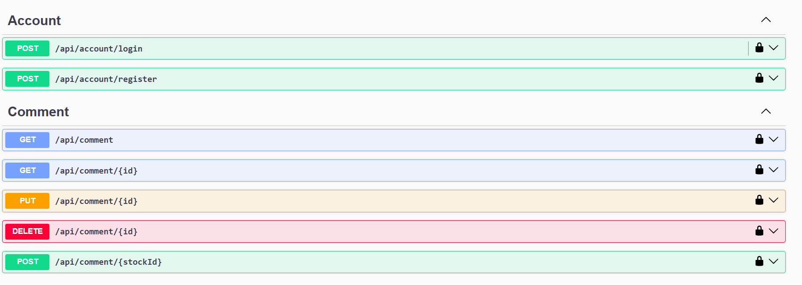
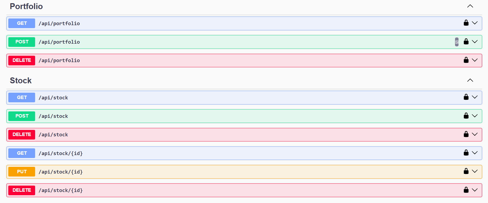
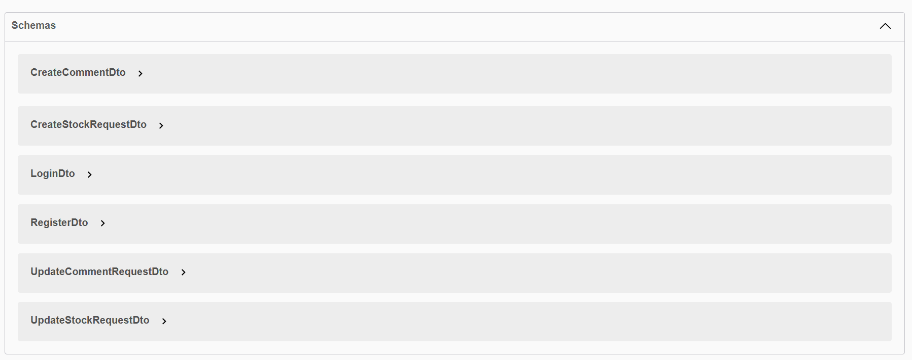

# Development Guidelines and Documentation

This document outlines the process and best practices followed during the development of the application. It serves as step-by-step guidance for revisiting or extending the project and includes documentation for key features with descriptive purposes.

---

## 1. Database Setup

**Purpose:**
The database layer forms the foundation for data management within the application, transforming relational data into entities.

**Steps:**
1. Define a `DbContext` (`ApplicationDbContext`) class for database access.
2. Set up `DbSet<T>` properties for each model representing a database table.
3. Add the database connection string to `appsettings.json`.
4. Register the `DbContext` in `Program.cs` using:
   ```csharp
   builder.Services.AddDbContext<ApplicationDbContext>(options =>
       options.UseSqlServer(builder.Configuration.GetConnectionString("DefaultConnection")));
   ```
5. Use EF migrations to create or update the database schema:
   ```bash
   dotnet ef migrations add InitialMigration
   dotnet ef database update
   ```

---

## 2. Defining Models (Entities)

**Purpose:**
Models in the application map to database tables and encapsulate data required for application functionality.

**Steps:**
- Create plain C# classes to represent entities.
- Define navigation properties for relationships (One-To-Many, Many-To-Many, etc.).
- Avoid placing validations or business logic directly in the entity classes; use DTOs and services to handle these.

---

## 3. Repository Pattern

**Purpose:**
To isolate data access logic, promoting modularity and easier testing.

**Steps:**
1. Create repository interfaces (e.g., `IRepository<T>`).
2. Implement these interfaces to encapsulate database operations.
3. Register repositories in `Program.cs` using scoped lifetimes:
   ```csharp
   builder.Services.AddScoped<IRepository<Comment>, Repository<Comment>>();
   ```

---

## 4. DTOs and Validation

**Purpose:**
DTOs (Data Transfer Objects) streamline the transfer of data between layers and shield sensitive information.

**Steps:**
- Design specific DTOs for request payloads and response objects.
- Annotate properties with validation attributes:
  ```csharp
  public class CreateUserRequest
  {
      [Required]
      [EmailAddress]
      public string Email { get; set; }

      [Required]
      [MinLength(6)]
      public string Password { get; set; }
  }
  ```
- Use libraries like AutoMapper to map between DTOs and entities.

---

## 5. Controllers and Endpoints

**Purpose:**
Controllers act as the entry point for client interactions, handling HTTP requests and responses.

**Steps:**
1. Create controllers segregating logic by domain or feature.
2. Use RESTful conventions (e.g., `GET`, `POST`, `PUT`, `DELETE`).
3. Include meaningful HTTP responses (`200 OK`, `404 Not Found`, etc.).
4. Secure endpoints using `[Authorize]` attribute where required.

---

## 6. Authorization and Authentication

**Purpose:**
Implement security measures to restrict access to authorized users and define policies based on roles or claims.

**Steps:**
1. Implement JWT-based authentication to issue secure tokens upon user login.
2. Populate tokens with user claims for flexibility and scalability.
3. Secure endpoints using claims-based policies:
   ```csharp
   [Authorize(Policy = "AdminOnly")]
   public IActionResult AdminEndpoint() => Ok("Admin access granted.");
   ```

---

## 7. Features and Justifications

- **Pagination:** Dividing large datasets for optimized performance during retrieval.
    - Implementation: `Skip()` and `Take()` methods combined with sorting.
- **Filtering:** Dynamically crafting queries for selective data access.
    - Implementation: Use `AsQueryable()` for deferred execution.
- **Token Services:** Securing user sessions and defining granular access levels using JWT claims.
- **Dependency Injection (DI):** Reducing tight coupling of components to improve testability and scalability.

---

## 8. Application Architecture

**Purpose:**
Maintain separation of concerns to simplify maintenance and future development.

## 9. Dependency Injection (DI)

**Purpose:**
DI facilitates the loose coupling of components and promotes modular design.

**Key Steps:**
1. Register dependencies in the DI container using `AddScoped`, `AddTransient`, or `AddSingleton` based on lifetime requirements.
2. Inject dependencies into controllers, services, or other layers via constructors.

---

## 10. Development Practices and Notes

**Best Practices:**
- Write clean and modular code, adhering to the principles of SOLID.
- Use interfaces to abstract implementations and increase flexibility.
- Keep controllers thin, delegating all logic to services or repositories.
- Consistently test components using mock implementations.

**Additional Notes:**
- Ensure sensitive data, such as connection strings and secrets, are stored securely in environment variables.
- Regularly update NuGet packages and .NET versions to leverage new features and security patches.

---

# Building a Web API from Scratch - Step-by-Step Guide

---

## 1. Initial Setup

1. Create a new Web API project using the .NET CLI or Visual Studio:
   ```bash
   dotnet new webapi -n YourProjectName
   cd YourProjectName
   ```
2. (Optional) Configure `launchSettings.json` if needed for debugging purposes.

---

## 2. Database Setup

1. Install required NuGet packages:
   ```bash
   dotnet add package Microsoft.EntityFrameworkCore
   dotnet add package Microsoft.EntityFrameworkCore.SqlServer
   ```
2. Create a `DbContext` class (e.g., `ApplicationDbContext`) to manage interactions with the database.
3. Update the `appsettings.json` with your connection string:
   ```json
   "ConnectionStrings": {
       "DefaultConnection": "YourDatabaseConnectionString"
   }
   ```
4. Configure the `DbContext` in `Program.cs`:
   ```csharp
   builder.Services.AddDbContext<ApplicationDbContext>(options =>
       options.UseSqlServer(builder.Configuration.GetConnectionString("DefaultConnection")));
   ```
5. Run migrations to initialize your database:
   ```bash
   dotnet ef migrations add InitialMigration
   dotnet ef database update
   ```

---

## 3. Models (Entities)

1. Define plain C# classes that represent your database tables.
2. Configure relationships (e.g., One-To-Many, Many-To-Many) using navigation properties.
3. Use Data Annotations or Fluent API to apply entity configurations as needed.

---

## 4. Implement the Repository Pattern

1. Define repository interfaces (e.g., `IRepository<T>`).
2. Implement repository logic to handle the database operations for each entity.
3. Register repository services in dependency injection (DI) within `Program.cs`:
   ```csharp
   builder.Services.AddScoped<IRepository<T>, Repository<T>>();
   ```

---

## 5. Authentication and Authorization

1. Install required NuGet packages for authentication:
   ```bash
   dotnet add package Microsoft.AspNetCore.Authentication.JwtBearer
   dotnet add package Microsoft.AspNetCore.Identity
   ```
2. Configure Identity for user management in `Program.cs`:
   ```csharp
   builder.Services.AddIdentity<AppUser, IdentityRole>(options =>
   {
       options.Password.RequireDigit = true;
       options.Password.RequireNonAlphanumeric = true;
       options.Password.RequiredLength = 12;
   }).AddEntityFrameworkStores<ApplicationDbContext>();
   ```
3. Set up JWT Authentication:
    - Define JWT configurations in `appsettings.json`.
    - Configure JWT in `Program.cs`:
      ```csharp
      builder.Services.AddAuthentication(JwtBearerDefaults.AuthenticationScheme)
        .AddJwtBearer(options =>
        {
            options.TokenValidationParameters = new TokenValidationParameters
            {
                ValidateIssuer = true,
                ValidateAudience = true,
                ValidateLifetime = true,
                ValidateIssuerSigningKey = true,
                ValidIssuer = builder.Configuration["JWT:Issuer"],
                ValidAudience = builder.Configuration["JWT:Audience"],
                IssuerSigningKey = new SymmetricSecurityKey(
                    Encoding.UTF8.GetBytes(builder.Configuration["JWT:SigningKey"]))
            };
        });
      ```

---

## 6. Controllers and Endpoints

1. Create controllers for each major domain or feature.
2. Follow REST principles:
    - `GET` for reading data.
    - `POST` for creating data.
    - `PUT` for updating data.
    - `DELETE` for removing data.
3. Example controller:
   ```csharp
   [ApiController]
   [Route("api/[controller]")]
   public class ExampleController : ControllerBase
   {
       private readonly IRepository<Example> _repository;

       public ExampleController(IRepository<Example> repository)
       {
           _repository = repository;
       }

       [HttpGet]
       public async Task<IActionResult> GetAll() => Ok(await _repository.GetAllAsync());
   }
   ```

---

## 7. Use DTOs and Validate Data

1. Use Data Transfer Objects (DTOs) for request/response payloads.
2. Add validation attributes to DTOs for input validation:
   ```csharp
   public class CreateExampleDto
   {
       [Required]
       public string Name { get; set; }
   }
   ```
3. Install and configure `AutoMapper` to map DTOs to entities:
   ```bash
   dotnet add package AutoMapper.Extensions.Microsoft.DependencyInjection
   ```

---

## 8. Enable Documentation

1. Install Swagger for API documentation:
   ```bash
   dotnet add package Swashbuckle.AspNetCore
   ```
2. Configure Swagger in `Program.cs`:
   ```csharp
   builder.Services.AddSwaggerGen();
   ```
3. Add middleware to serve Swagger UI (only in development environment):
   ```csharp
   if (app.Environment.IsDevelopment())
   {
       app.UseSwagger();
       app.UseSwaggerUI();
   }
   ```

---

## 9. Testing

1. Unit test repositories and services using tools like `xUnit` and `Moq`.
2. Integration test controllers using in-memory DB or external testing tools (Postman, Swagger).

---

## 10. Additional Features

- **Pagination:** Implement with `Skip()` and `Take()` for performance improvement.
- **Filtering:** Use `AsQueryable()` to delay execution until necessary filtering is applied.
- **Global Exception Handling:** Add middleware to handle errors consistently.

---

## Final Steps Checklist

1. **Set up the project:** Verify that `DbContext`, entities, and configurations are in place.
2. **Apply patterns:** Use the Repository Pattern and Dependency Injection for clean code.
3. **Secure the app:** Implement robust JWT-based Authentication.
4. **Document:** Use Swagger/OpenAPI for comprehensive API documentation.
5. **Validate:** Ensure robust input validation and meaningful error handling.
6. **Test thoroughly:** Test every layer from unit tests to integration tests.

---

## Screenshots and Visual Documentation

### Screenshot 1: API Endpoints


Documentation of available API endpoints and their respective HTTP methods.

### Screenshot 2: API Endpoints


Documentation of available API endpoints and their respective HTTP methods.

### Screenshot 3: Database Schema


Visual representation of the database schema and relationships between entities.
